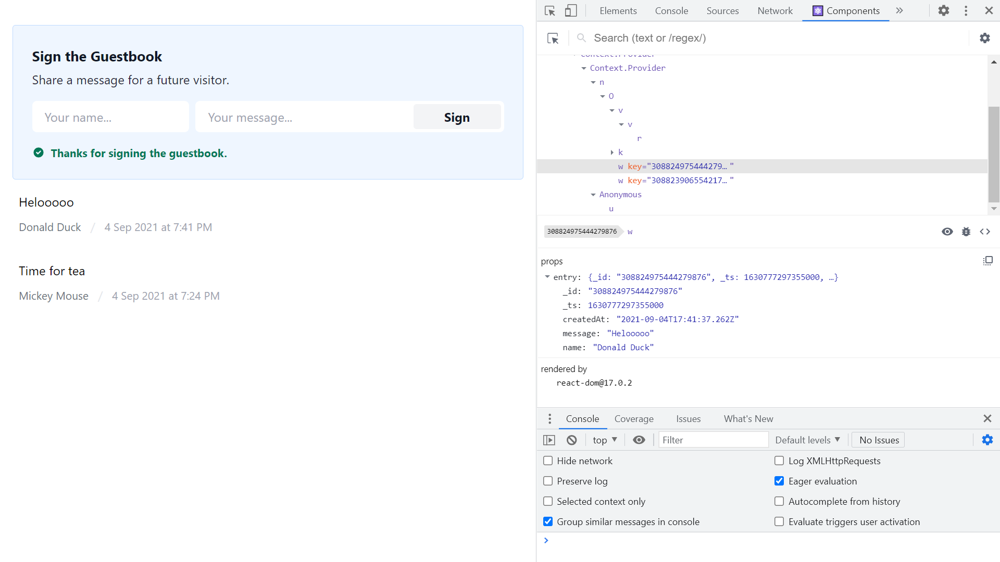
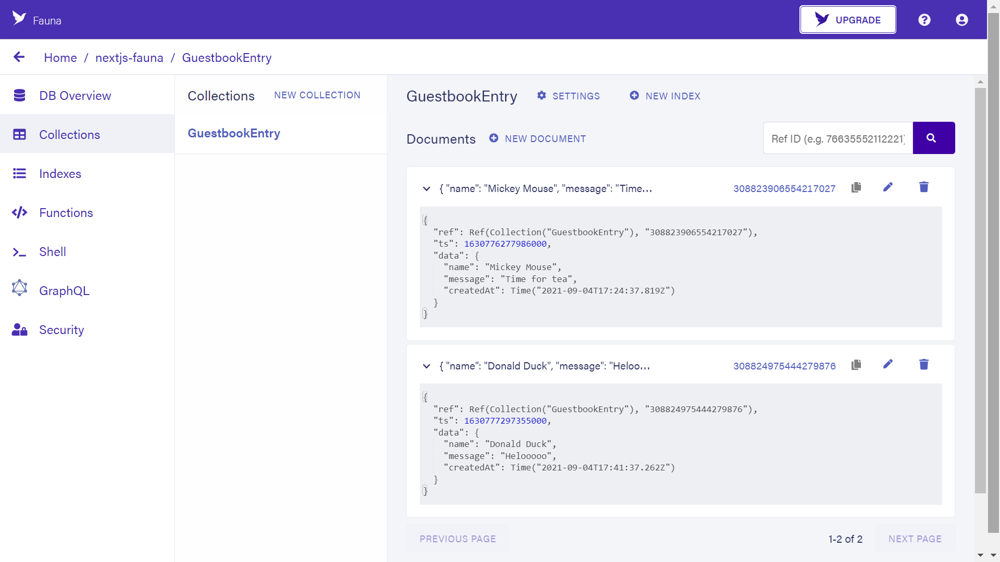

# :zap: Next Fauna Data

* A Next.js Guestbook app with Fauna backend using GraphQL, boilerplate code from Vercel
* **Note:** to open web links in a new window use: _ctrl+click on link_


## :page_facing_up: Table of contents

* [:zap: Next Fauna Data](#zap-next-fauna-data)
  * [:page_facing_up: Table of contents](#page_facing_up-table-of-contents)
  * [:books: General Info](#books-general-info)
  * [:camera: Screenshots](#camera-screenshots)
  * [:signal_strength: Technologies](#signal_strength-technologies)
  * [:floppy_disk: Setup](#floppy_disk-setup)
  * [:computer: Code Examples](#computer-code-examples)
  * [:clipboard: Status & To-Do List](#clipboard-status--to-do-list)
  * [:clap: Inspiration](#clap-inspiration)
  * [:file_folder: License](#file_folder-license)
  * [:envelope: Contact](#envelope-contact)

## :books: General Info

* [Vercel Fauna integration](https://vercel.com/integrations/fauna) project with Fauna database
* [Fauna data API](https://fauna.com/) transactional database used as a cloud API with native GraphQL
* [Next.js](https://nextjs.org/) used for frontend
* [Tailwind CSS](https://tailwindcss.com/) used for styling

## :camera: Screenshots




## :signal_strength: Technologies

* [Fauna data API](https://fauna.com/) transactional database used as a cloud API with native GraphQL with [FaunaDB Javascript Driver](https://www.npmjs.com/package/faunadb)
* [Next v11](https://nextjs.org/) minimalist framework for rendering react apps on the server.
* [React v17](https://reactjs.org/) Javascript library.
* [GraphQL v15](https://graphql.org/) API query language
* [Tailwind v2](https://tailwindcss.com/) utility-first CSS framework
* [PostCSS v8](https://postcss.org/) tool for transforming CSS with JavaScript

## :floppy_disk: Setup

* `npm run dev` runs the app in the development mode. Open [http://localhost:3000](http://localhost:3000) to view it in the browser. **Note:** requires Fauna API key
* `npm run build` builds the app for production to the `build` folder. **Note:** requests Fauna API key
* `npm run start` to run the built app.

## :computer: Code Examples - taken from Vercel boilerplate code

* `lib/fauna.js` mutation function to create a new guestbook entry

```javascript
export const createGuestbookEntry = (newEntry) => {
  const mutation = gql`
    mutation CreateGuestbookEntry($input: GuestbookEntryInput!) {
      createGuestbookEntry(data: $input) {
        _id
        _ts
        name
        message
        createdAt
      }
    }
  `

  return graphQLClient.request(mutation, { input: newEntry })
}
```

## :clipboard: Status & To-Do List

* Status: Working. Deployed to Vercel
* To-Do: Add extra fields and a user image/icon. Need Fauna API key to run dev. server

## :clap: Inspiration

* [Fauna GraphQL Reference](https://docs.fauna.com/fauna/current/api/graphql/)

## :file_folder: License

* N/A

## :envelope: Contact

* Repo created by [ABateman](https://github.com/AndrewJBateman), email: gomezbateman@yahoo.com
